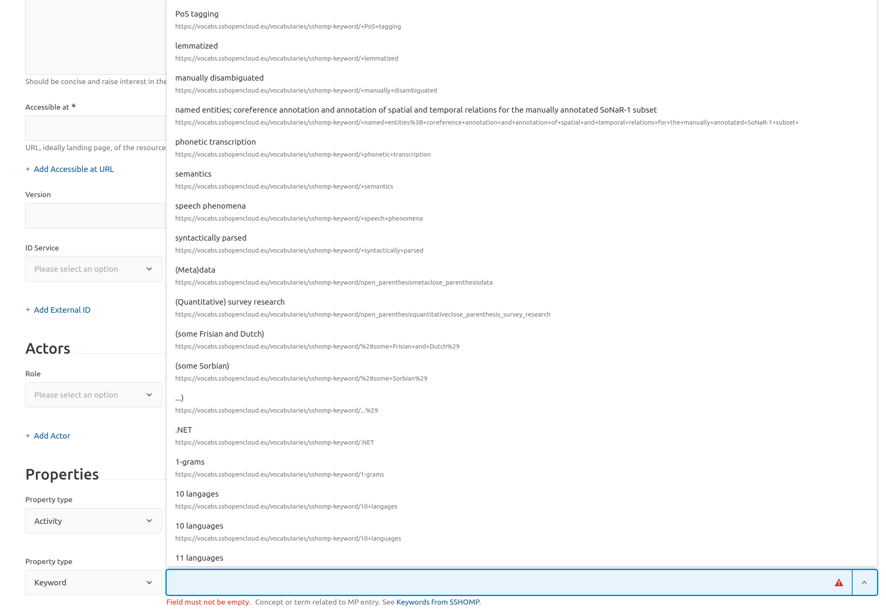
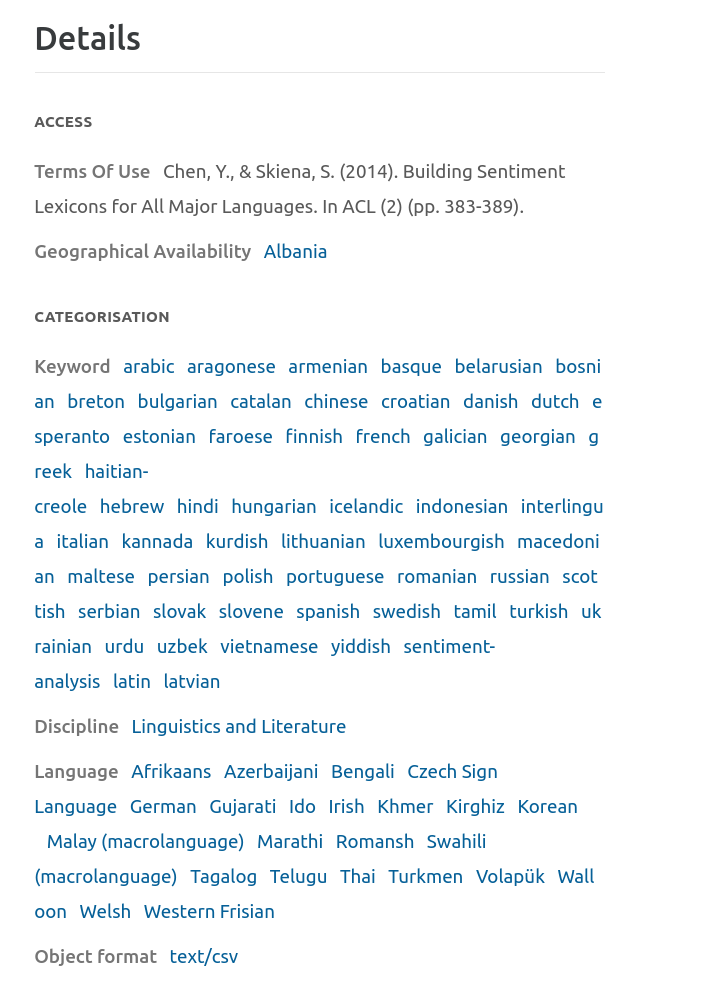
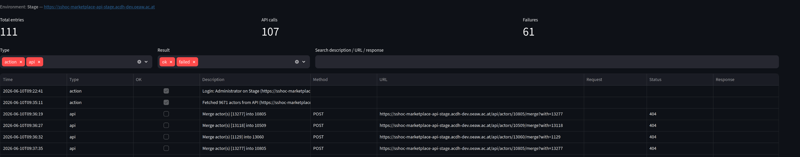

# SSH Open Marketplace — Curation Toolkit

A local Streamlit web application for curating the [SSH Open Marketplace](https://marketplace.sshopencloud.eu/) (SSHOMP). It reads data from a local [sshompitor](https://github.com/SSHOC/sshompitor) snapshot for fast offline analysis and writes back to the live Marketplace API for any changes.

---

## Contents

1. [Overview](#overview)
2. [Prerequisites](#prerequisites)
3. [Setup](#setup)
4. [Running the app](#running-the-app)
5. [Architecture](#architecture)
6. [Login & environments](#login--environments)
7. [Tool reference](#tool-reference)
   - [Data Source](#data-source)
   - [Actor Duplicates](#actor-duplicates)
   - [Item Duplicates](#item-duplicates)
   - [Contributors](#contributors)
   - [URL Checker](#url-checker)
   - [Keywords](#keywords)
   - [Session Log](#session-log)
8. [Data freshness](#data-freshness)
9. [API reference](#api-reference)
10. [Library reference](#library-reference)
11. [Caveats & known limitations](#caveats--known-limitations)
12. [Troubleshooting](#troubleshooting)

---

## Overview

The SSH Open Marketplace accumulates data quality issues over time: duplicate actors, broken access URLs, orphaned entries, and keywords that duplicate concepts already defined in controlled vocabularies. These issues are difficult to spot and fix through the standard Marketplace web interface.

This toolkit provides a set of purpose-built curation screens that:

- Load the full Marketplace dataset from a local snapshot for fast, offline analysis
- Verify findings against the live API before making any changes
- Write changes back through the official Marketplace REST API with appropriate safeguards
- Record every API write call and major action in an exportable session log

The toolkit is intended for Marketplace **moderators and administrators**. All write operations require a valid account token and respect the API's own permission checks.

---

## Prerequisites

| Requirement | Notes |
|---|---|
| Python 3.10+ | Tested on 3.10–3.12 |
| Marketplace account | Moderator or administrator role required for write operations |

No local clone of sshompitor is required. The `sshmarketplacelib` Python package is installed directly from GitHub as part of the normal dependency install, and a bundled `config.yaml` provides the configuration it needs. Snapshot data is downloaded on first use from the Data Source page.

---

## Setup

### 1. Install dependencies

```bash
pip install -r requirements.txt
```

This installs all required packages including `sshmarketplacelib` (pulled directly from the [sshompitor GitHub repository](https://github.com/SSHOC/sshompitor)):

```
streamlit>=1.35, pandas, numpy, pyyaml, pillow, requests, fastparquet, sshmarketplacelib
```

### 2. Create the data directory

```bash
python3 setup.py
```

This creates the `data/` directory where snapshot files will be stored. No symlinks or local sshompitor clone required.

### 3. Download the first snapshot

Start the app, log in, and use the **Data Source** page (the landing page) to download the current snapshot from GitHub or fetch fresh data from the API.

---

## Running the app

```bash
streamlit run app.py
```

Open [http://localhost:8501](http://localhost:8501) in a browser. After login you are taken directly to the Data Source page.

---

## Login & environments

The login screen lets you choose between **Production** and **Stage** before signing in.

| Environment | API base URL |
|---|---|
| Production | `https://marketplace-api.sshopencloud.eu` |
| Stage | `https://sshoc-marketplace-api-stage.acdh-dev.oeaw.ac.at` |

Credentials are sent via `POST /api/auth/sign-in`. On success the `Authorization` header from the response is stored as a bearer token in session state and attached to all subsequent API requests.

Navigating directly to any tool page without being logged in redirects back to the login screen (`require_login()` in `lib/auth.py`).

> **Recommendation**: always test changes on **Stage** first. The Stage environment is a full copy of Production and its data can be reset.

---

## Tool reference

### Data Source

**File:** `pages/1_Data.py`  
**Landing page after login.**

Shows the current environment, login user, and all snapshot files present in `data/`. The most recently modified file is the active snapshot used by all tools.

#### Snapshot table

Lists every `full_items_*.json` file in `data/` with its date, age, and size. The active (newest) file is marked.

#### Get data

| Button | What it does |
|---|---|
| **Download latest snapshot** | Queries the GitHub Contents API for the newest snapshot in the sshompitor repository and streams it to `data/`. Fast (typically a few seconds). |
| **Create fresh snapshot** | Fetches all items from the live Marketplace API across all five categories (tools, publications, training materials, workflows, datasets) and saves a new `full_items_{timestamp}.json`. Takes several minutes. |

After either operation, all page caches are cleared automatically and the page reloads.

#### Old snapshot cleanup

If multiple snapshots are present, an expander lists older files with individual **Delete** buttons to free disk space.

---

### Actor Duplicates

**File:** `pages/2_Actor_Duplicates.py`

Two tabs for finding and resolving actor-level duplicates and orphaned entries.

---

#### Tab 1 — Find Duplicates

Finds actors that share a `name` or `website` value. These are common when items are imported from different sources with slightly different contributor metadata.

##### Email loading

Before running the duplicate search, you can optionally load actor email addresses from the API. Click **Load actor emails from API** to fetch all ~9,000 actors. This data is stored in `st.session_state["actor_details"]` and shared with the Contributors page and the Orphaned Actors tab — it only needs to be fetched once per session.

Loading emails enables **confidence scoring**:

| Confidence | Condition |
|---|---|
| **High** (★) | At least two actors in the group share the same non-empty email address |
| **Low** | Name match only; email is absent or different across actors |

High-confidence groups — where actors share **both name and email** — are almost certainly the same person and are shown first under a dedicated **Suggested merges** section. They open expanded by default.

##### Running the search

1. Select which field(s) to match on: `name`, `website`.
2. Click **Find Duplicates**.

Internally calls `Util.getDuplicatedActorsWithItems()` from sshompitor. Results are grouped by duplicate name. For each group an expander shows:

- A table with each actor's ID, item count, example item link, and email (if loaded)
- The confidence level (high/low)
- A **Keep this actor** selectbox — the chosen actor absorbs all others
- A **Merge** button

**Merge behaviour:**
- Calls `POST /api/actors/{keep_id}/merge?with={other_ids}`
- The API merges all item associations and external IDs into the kept actor and deletes the others
- The merge button is disabled after a successful merge (stored in `merged_groups` session state)
- The expander stays open after a merge — you do not need to re-run the search to see remaining groups

---

#### Tab 2 — Orphaned Actors

Finds actors that are not associated with any Marketplace item and allows bulk deletion.

The process runs in four explicit steps:

**Step 1 — Load actors from the API**

Fetches the full actor list from `GET /api/actors` (paginated, 100 actors per page). This data is shared with the Find Duplicates tab — loading here also populates the email data used for confidence scoring. The API does not return item associations in the paginated listing.

**Step 2 — Cross-reference with snapshot**

Actors absent from the snapshot are flagged as **candidates**. A stale snapshot will produce false positives — actors added to items after the snapshot date will appear as candidates even though they are not orphaned.

**Step 3 — Verify candidates via the live API**

For each candidate, calls `GET /api/actors/{id}?items=true` to check whether the API itself considers the actor item-free. This is the authoritative check.

Requests run in configurable batches (default: 50 concurrent per batch). A 300 ms pause between batches avoids overloading the API. Each request retries up to three times on HTTP 5xx errors, timeouts, and connection errors. Actors that cannot be verified are classified as **uncertain**, shown in a separate expander, and excluded from deletion.

**Step 4 — Review and delete**

Confirmed orphans are shown in an editable table. All rows start **unchecked** — you must explicitly select actors for deletion.

Deletion calls `DELETE /api/actors/{id}?force=false`. The `force=false` parameter means the API will refuse to delete an actor that is affiliated with another actor (e.g. a researcher listed under a university). Refused deletions are reported individually and the actor is left intact. Successfully deleted actors are removed from session state immediately so the table updates without a full reload.

---

### Item Duplicates

**File:** `pages/3_Item_Duplicates.py`

Scans snapshot items for shared values in selected fields.

**How to use:**
1. Select one or more categories to narrow the search scope.
2. Choose which fields to check: `label`, `description`, `accessibleAt`.
3. Click **Find Duplicates**.

Internally calls `Util.getDuplicates(subset, fields_csv)`. Results include matched field values and links to each item in the Marketplace. Download as CSV for offline review.

---

### Contributors

**File:** `pages/4_Contributors.py`

Displays every actor–item contribution relationship from the current snapshot as a filterable, sortable table.

#### Data source

Built from `Util.getContributors()`, which reads the snapshot and returns one row per actor–item pair. Each row includes the item's `category`, `persistentId`, `label`, the actor's `name`, `website`, and the contribution `role.label`.

The **Item link** column links to the contributed item. Actors do not have dedicated public profile pages in the Marketplace.

#### Email filter

Actor email addresses are not stored in the snapshot. Click **Load actor emails from API** in the sidebar to fetch all ~9,000 actors and join their emails into the table (stored in `st.session_state["actor_details"]`, shared across pages).

#### Filters

| Filter | Behaviour |
|---|---|
| Category | Multiselect; defaults to all categories |
| Role | Multiselect; defaults to all roles |
| Actor name | Case-insensitive substring match |
| Actor email | Case-insensitive substring match; only shown after actor data is loaded |

#### Export

The filtered view can be downloaded as CSV.

---

### URL Checker

**File:** `pages/5_URL_Checker.py`

Checks whether URLs in the snapshot are reachable, and surfaces items with broken or unreachable links.

#### Scope modes

| Mode | What is checked |
|---|---|
| `accessibleAt only` | The primary access URLs for each item |
| `All URLs in entry` | Every `http(s)` URL in any field of the item, including thumbnails, media, external IDs, and descriptions |

#### Workflow

1. Select categories and scope, then click **Extract URLs**. Scans the snapshot and reports how many unique URLs were found — no HTTP requests yet.
2. Set **Timeout** and **Parallel workers**, then click **Check URLs**.
3. Each URL is checked with HTTP `HEAD`. Servers responding `405 Method Not Allowed` or `501 Not Implemented` are retried with a streaming `GET`.

#### Results

Sorted by **items with the most broken URLs first**, then by item, then broken-before-OK within each item. Filter to Broken only / OK only / All. The same URL appearing on multiple items is checked once and joined to all rows.

---

### Keywords

**File:** `pages/6_Keywords.py`

Audits and curates the `sshoc-keyword` vocabulary.

Unlike the other Marketplace vocabularies (languages, disciplines, standards), the keyword vocabulary grows organically and is not formally governed. This leads to three classes of quality issues:

1. **Unused concepts** — keywords registered in the vocabulary but not applied to any item
2. **Malformed labels** — keywords with leading spaces, no alphabetical characters, or excessive length
3. **Cross-vocabulary duplicates** — keywords whose labels already exist as concepts in a controlled vocabulary

The screenshot below (from the Marketplace item editor keyword picker) illustrates all three classes at once:



Visible examples:
- **`...`** — a punctuation-only entry with no alphabetical content (caught by the *No letters* filter in Tab 2, or appears as unused in Tab 1)
- **`10 langages`** — a typo duplicate of `10 languages`; both exist as separate vocabulary entries (Tab 1 / Tab 2)
- **`(some Frisian and Dutch)`**, **`(some Sorbian)`** — informal language qualifiers that belong in the `language` vocabulary (Tab 3)
- **`named entities; coreference annotation and annotation of spatial and temporal relations for the manually annotated SoNaR-1 subset`** — a sentence-length label that is clearly description text rather than a keyword (caught by the *Longer than N characters* filter in Tab 2)

#### Loading data

Click **Load keyword concepts from API** to fetch all concepts in the `sshoc-keyword` vocabulary from `GET /api/concept-search?types=keyword` (~2,600 concepts, ~27 pages).

Keywords are also extracted from the local snapshot via `Util.getAllProperties()`, giving one row per item–keyword pair. The two datasets are cross-referenced by concept code.

#### The `candidate` flag

The API marks concepts as `candidate: true` if submitted by a user and not yet formally reviewed. The **Candidates only** checkbox in the Unused tab filters to this subset.

---

#### Tab 1 — Unused

Concepts registered in the vocabulary that do not appear on any item in the current snapshot.

**Filters:** free-text search on label or code; toggle to show only candidate concepts.

**Deletion:** tick `Delete?`, confirm, and click **Delete**. Calls `DELETE /api/vocabularies/sshoc-keyword/concepts/{code}?force=true`.

The `force=true` parameter is required because the API keeps a full version history of every item. Older revisions of an item may still reference a keyword even after it has been removed from the current version. The API counts those historical references as "in use" and refuses a plain delete. `force=true` removes the concept from the vocabulary and clears any lingering references across all item versions.

Successfully deleted concepts are removed from the in-session vocabulary immediately.

---

#### Tab 2 — In use

All concepts appearing on at least one item, sorted by usage count descending.

**Quality filters** (independent, combinable):

| Filter | Detects |
|---|---|
| Starts with space | Labels like `" machine learning"` that sort and display incorrectly |
| No letters | Labels composed entirely of numbers or symbols |
| Longer than N characters | Labels that are suspiciously long — often pasted text |

---

#### Tab 3 — Duplicates in other vocabs

Finds **used** keywords whose label also exists as a concept in another Marketplace vocabulary. Example: `xml` in `sshoc-keyword` duplicates the `xml` concept in the `standard` vocabulary.

Only keywords that are actually in use are shown — unused duplicates belong in Tab 1 (Unused) and cannot be fixed here since fixing requires updating item properties.

A common and high-volume case is **language names entered as keywords**. The Marketplace has a dedicated `language` vocabulary, but items are sometimes imported or tagged with language names (arabic, french, spanish, …) in the free-text keyword field instead. The screenshot below shows an item where dozens of language names appear under *Keyword* even though the item also has correct *Language* entries:



Using the fix workflow in this tab, each `sshoc-keyword` language entry can be re-pointed to the corresponding concept in the `language` vocabulary in a single operation per keyword.

**How to use:**
1. Click **Load all concepts from API (~15 000)** to fetch all concepts across all vocabularies (cached in session state).
2. The tool performs a case-insensitive label match between `sshoc-keyword` concepts and all other-vocabulary concepts.
3. Use the **concept type filter** to narrow results.

**Fixing items:**

1. Select a keyword → target concept pair from the dropdown.
2. The tool shows all items using that keyword. A warning is shown if more than one item will be affected.
3. Click **Fix N item(s)**.

For each affected item:
- `GET /api/{category-path}/{persistentId}` retrieves the full item payload
- The matching property (`type.code = "keyword"`, `concept.code = {old_code}`) is updated to the target type and concept
- `PUT /api/{category-path}/{persistentId}` writes the modified payload back

> **Important:** the PUT endpoint requires the complete item payload. If the item is edited concurrently, those changes will be overwritten. Use this during low-traffic periods and on Stage before Production.

---

#### Tab 4 — All concepts

Complete `sshoc-keyword` vocabulary with usage counts. Searchable by label or code.

---

### Session Log

**File:** `pages/7_Session_Log.py`

Records every significant action and API write call made during the current session.



#### What is logged

| Entry type | Examples |
|---|---|
| `action` | Login, snapshot download, actor fetch, orphan verification summary |
| `api` | `DELETE /api/actors/{id}`, `POST /api/actors/{id}/merge`, `PUT /api/{path}/{id}`, `DELETE /api/vocabularies/…/concepts/{code}` |

Every API write entry records: timestamp, HTTP method, full URL, request summary, HTTP status code, and the first 1,000 characters of the response body.

#### Filters

Filter by entry type (action / api), result (ok / failed), and free-text search across description, URL, and response.

#### Export

- **Export filtered as CSV** — the current filtered view as a spreadsheet
- **Export full log as JSON** — the complete unfiltered log as a JSON array (useful for detailed audit review)

**Clear log** resets the in-session log. The log does not persist across browser sessions.

#### Sidebar indicator

The sidebar on every page shows a `Session log: N entries` count once any entries exist, so you can track activity without navigating to the log page.

---

## Data freshness

The local snapshot is a JSON export of the full Marketplace catalogue. The filename embeds a Unix timestamp (`full_items_{timestamp}.json`).

A **data age badge** appears in the sidebar of every page:
- **Green** — snapshot is less than 3 days old
- **Orange** — snapshot is 3 or more days old

If no snapshot is found when navigating to a tool page, a full-page prompt appears with options to download from GitHub or create from the API. This prevents confusing errors from pages that require snapshot data.

A stale snapshot affects:
- **Orphaned actors** — recently-contributed actors may appear as candidates
- **Unused keywords** — recently-tagged keywords may appear as unused
- **Actor duplicate detection** — recently-merged actors may still appear as duplicates
- **Cross-vocab duplicate detection** — recently-added item–keyword associations may be missed

---

## API reference

All write operations target the environment selected at login.

| Operation | Method | Endpoint | Notes |
|---|---|---|---|
| Login | POST | `/api/auth/sign-in` | Returns bearer token in `Authorization` header |
| List actors | GET | `/api/actors?perpage=100&page={n}` | ~95 pages for full list |
| Check actor items | GET | `/api/actors/{id}?items=true` | Authoritative orphan check |
| Merge actors | POST | `/api/actors/{id}/merge?with={ids}` | Comma-separated IDs to absorb |
| Delete actor | DELETE | `/api/actors/{id}?force=false` | Refused if actor has affiliations |
| Get item | GET | `/api/{category-path}/{persistentId}` | Full item payload |
| Update item | PUT | `/api/{category-path}/{persistentId}` | Requires full item payload |
| List keyword concepts | GET | `/api/concept-search?types=keyword&perpage=100` | ~27 pages |
| List all concepts | GET | `/api/concept-search?perpage=100` | ~152 pages; all vocabularies |
| Delete concept | DELETE | `/api/vocabularies/{vocab}/concepts/{code}?force=true` | Also clears historical item-version references |
| Fetch category items | GET | `/api/{category-path}?perpage=50&page={n}` | Used when creating a fresh snapshot |

### Category path mapping

| Snapshot `category` | API path segment |
|---|---|
| `tool-or-service` | `tools-services` |
| `training-material` | `training-materials` |
| `dataset` | `datasets` |
| `publication` | `publications` |
| `workflow` | `workflows` |
| `step` | `steps` |

---

## Library reference

### `lib/environments.py`

Defines the two target environments (Production and Stage) with their API base URLs and frontend URLs.

### `lib/auth.py`

`try_login(username, password, env_name)` — posts credentials to `/api/auth/sign-in` and returns the bearer token string, or `None` on failure.

`require_login()` — called at the top of every page file. Redirects to the login page and stops rendering if the session is unauthenticated.

### `lib/mplib.py`

`get_util()` — returns a cached `Util` instance (`@st.cache_resource`). Tries the pip-installed `sshmarketplacelib` package first; falls back to a sibling `../sshompitor/` clone if the package is not installed. The `Util` class loads the snapshot on first instantiation.

### `lib/api.py`

All functions that communicate with the live Marketplace API. Every write function calls `log_api()` automatically.

| Function | Description |
|---|---|
| `fetch_all_actors(api_url, bearer)` | Paginates `GET /api/actors`; returns DataFrame `[id, name, email, website, item_count]` |
| `verify_orphans(ids, api_url, bearer, batch_size)` | Batched `GET /api/actors/{id}?items=true` with retries; returns `dict[id → bool\|None]` |
| `delete_actor(actor_id)` | `DELETE /api/actors/{id}?force=false` |
| `merge_actors(keep_id, merge_ids)` | `POST /api/actors/{id}/merge?with={ids}` |
| `fetch_all_keyword_concepts(api_url, bearer)` | Paginates `GET /api/concept-search?types=keyword` |
| `fetch_all_concepts(api_url, bearer)` | Paginates `GET /api/concept-search` (all types) |
| `get_item(category, persistent_id, api_url, bearer)` | `GET /api/{path}/{id}`; returns full item dict |
| `put_item(category, persistent_id, item_data, api_url, bearer)` | `PUT /api/{path}/{id}` |
| `fix_item_keyword(category, persistent_id, old_code, new_type, new_concept, api_url, bearer)` | GET → modify property → PUT |
| `delete_concept(concept_code, vocab_code)` | `DELETE /api/vocabularies/{vocab}/concepts/{code}?force=true` |
| `create_snapshot_from_api(api_url, bearer, data_dir)` | Fetches all items from all 5 categories and saves `full_items_{ts}.json` |

### `lib/snapshot.py`

`get_latest_snapshot_info()` — returns `(path, age_timedelta, snapshot_datetime)` for the newest snapshot in `data/`.

`fetch_latest_from_github()` — queries the GitHub Contents API, downloads the newest snapshot if not already present, streams with a progress bar.

`require_snapshot()` — if no snapshot is present, stops page rendering and shows a full-page recovery UI offering GitHub download or API creation. Called at the top of every page that needs snapshot data.

`render_data_status()` — renders the age badge, GitHub refresh button, and session log entry count in the sidebar.

### `lib/logger.py`

Maintains a session log in `st.session_state["session_log"]`.

`log_action(description, ok)` — records a high-level event (login, snapshot creation, batch verification summary).

`log_api(method, url, description, status, request, response, ok)` — records an HTTP API call. Called automatically by all write functions in `lib/api.py`.

`get_log()` / `get_log_df()` — retrieve the current log as a list or DataFrame.

---

## Caveats & known limitations

**Snapshot staleness.** All analysis that reads from the local snapshot reflects the state of the Marketplace at snapshot time. Changes made through the toolkit or by other users will not be visible until the snapshot is refreshed. The data age badge in the sidebar makes this visible.

**Actor item count not in paginated API.** `GET /api/actors` does not return associated items in its response. Item counts are determined by snapshot cross-reference (step 2 of orphaned actor detection) and then confirmed individually via `GET /api/actors/{id}?items=true` (step 3).

**API instability.** The Stage environment in particular can return intermittent HTTP 5xx errors. All verification calls retry up to three times with exponential backoff. Actors that cannot be verified are classified as **uncertain** and excluded from deletion.

**Concept delete and item history.** The API maintains a full version history of every item. Older revisions may still reference a keyword that was removed from the current version of the item. The API considers these historical references as active and refuses a plain delete. This is why `force=true` is used for concept deletion — it removes the concept and purges all historical references.

**Concurrent item edits.** The keyword fix workflow uses GET-modify-PUT. If another user edits the same item between GET and PUT, their changes will be overwritten. Use during low-traffic periods, and on Stage before Production.

**`force=false` on actor deletion.** The API refuses to delete an actor that is the affiliation target of another actor. Such actors must have their affiliation relationship removed first, or be merged into the affiliated actor.

**Item PUT requires full payload.** Every item update sends the complete object returned by GET with only the target field modified. Fields absent from the GET response will be absent from the PUT and may be cleared server-side.

---

## Troubleshooting

**`ModuleNotFoundError: No module named 'sshmarketplacelib'`**
The package was not installed. Run `pip install -r requirements.txt`. If pip cannot reach GitHub, install manually: `pip install git+https://github.com/SSHOC/sshompitor.git#egg=sshmarketplacelib`. As a last resort, clone sshompitor into `../sshompitor/` — `lib/mplib.py` will find it automatically.

**No snapshot found — the Data Source page shows no files**
Run `python3 setup.py` to create the `data/` directory, then use the Data Source page to download a snapshot.

**Login fails with a network error**
The selected API server is unreachable. Check your internet connection and verify that the Stage or Production API is accessible. The Stage environment is occasionally taken offline for maintenance.

**`GET latest data from GitHub` downloads the same file again**
The local snapshot filename must exactly match the GitHub filename (including the Unix timestamp). If the file was renamed or copied, the comparison fails and the file is re-downloaded.

**Orphan verification produces many `uncertain` results**
The API is under load. Lower the batch size (try 20–30) and re-run verification. Uncertain actors are excluded from deletion and the result is cached in session state.

**Concept delete fails with HTTP 400 even with `force=true`**
The concept code may contain special characters (e.g. `+`, spaces) that need URL encoding. Check the `response` column in the Session Log for the full API error message.

**Item PUT returns HTTP 422 after keyword fix**
The target concept's `type_code` is not valid for this property type in the Marketplace schema. Review the `type_code` in the cross-vocabulary match and verify it is one of the recognised property type codes.

**After merging actors, the group still appears in results**
The snapshot has not been refreshed. The merge is complete on the server, but the local snapshot still reflects the pre-merge state. Use the Data Source page to download a fresh snapshot, then re-run duplicate detection.

**Session log is empty**
The log is in-memory only and resets when the browser session ends or the **Clear log** button is used. Export the log to CSV or JSON before closing the browser if you need a record.

---

## Architecture

### Data flow

```
GitHub (SSHOC/sshompitor)
        │  download on demand (fetch_latest_from_github)
        ▼
data/full_items_*.json  ◄── also created by create_snapshot_from_api()
        │
        ▼
sshmarketplacelib.Util  (loaded once, cached as st.cache_resource)
        │
        ├── getContributors()           ──► 4_Contributors
        ├── _load_snapshot()            ──► 2_Actor_Duplicates / 3_Item_Duplicates / 5_URL_Checker
        ├── getDuplicates()             ──► 3_Item_Duplicates
        ├── getDuplicatedActorsWithItems ──► 2_Actor_Duplicates
        └── getAllProperties()          ──► 6_Keywords

Live Marketplace API  ◄──► lib/api.py  ◄──► all write operations + actor verification + snapshot creation
                                │
                                └── lib/logger.py  ──► 7_Session_Log
```

### Page structure

| File | Page | Role |
|---|---|---|
| `app.py` | Login | Entry point; redirects to Data Source after login |
| `pages/1_Data.py` | Data Source | Landing page; snapshot management |
| `pages/2_Actor_Duplicates.py` | Actor Duplicates | Duplicate detection + orphan removal |
| `pages/3_Item_Duplicates.py` | Item Duplicates | Item field duplicate detection |
| `pages/4_Contributors.py` | Contributors | Filterable contribution table |
| `pages/5_URL_Checker.py` | URL Checker | Async URL reachability check |
| `pages/6_Keywords.py` | Keywords | Keyword vocabulary curation |
| `pages/7_Session_Log.py` | Session Log | Audit log with export |

### Session state

| Key | Type | Set by | Used by |
|---|---|---|---|
| `authenticated` | `bool` | Login | All pages |
| `bearer` | `str` | Login | All API calls |
| `username` | `str` | Login | Data Source display |
| `env` | `dict` | Login | All pages |
| `actor_details` | `DataFrame` | Actor Duplicates / Contributors | Actor Duplicates, Contributors |
| `actor_dup_summary` | `DataFrame` | Actor Duplicates | Actor Duplicates |
| `actor_dup_full` | `DataFrame` | Actor Duplicates | Actor Duplicates |
| `merged_groups` | `dict` | Actor Duplicates | Actor Duplicates (disables merge buttons) |
| `expander_open` | `dict` | Actor Duplicates | Actor Duplicates (keeps expanders open after merge) |
| `orphan_verified` | `dict` | Actor Duplicates | Actor Duplicates (verification results) |
| `url_check_input` | `DataFrame` | URL Checker | URL Checker |
| `url_check_results` | `DataFrame` | URL Checker | URL Checker |
| `keyword_vocab` | `DataFrame` | Keywords | Keywords |
| `all_concepts_cache` | `DataFrame` | Keywords | Keywords |
| `session_log` | `list[dict]` | All pages (via logger) | Session Log |

### Caching

| Decorator | Used for | Invalidated when |
|---|---|---|
| `@st.cache_resource` | `Util()` instance (loads the ~72 MB snapshot once) | Snapshot refreshed |
| `@st.cache_data` | Per-page derived DataFrames | Snapshot refreshed, or explicitly via `.clear()` |
